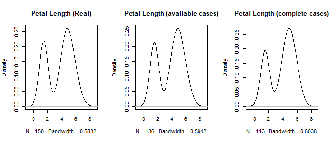
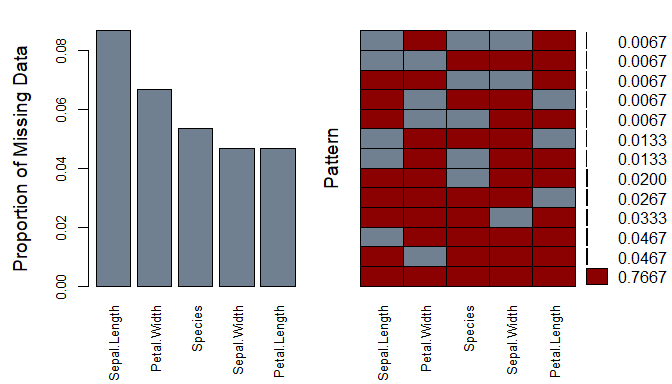
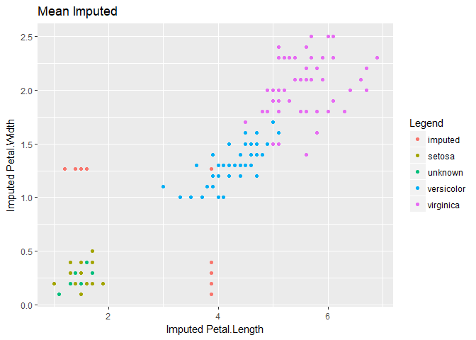
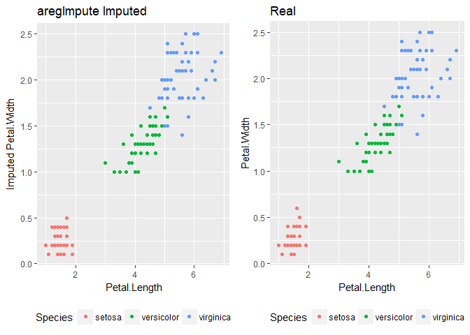
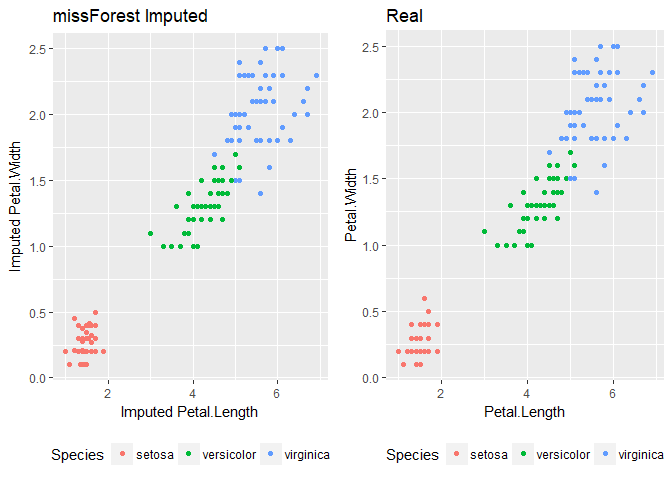

Missing Data Modeled
================
By Patrick D Mobley

Outline
-------

[Introduction](#introduction) <br> [Example data](#example-data) <br> [Understanding the problem & defining success](#understanding-the-problem-defining-success) <br> [Investigating missingness](#investigating-missingness) <br> [Methods to deal with missing data](#methods-to-deal-with-missing-data) <br> [Missing data packages in R](#missing-data-packages-in-r) <br> [Conclusion](#conclusion) <br> [Resources](#resources) <br>

Introduction
------------

Missing data analysis is often overlooked in the data modeling process, yet it is essential for developing high quality models. Before cleaning, nearly every dataset contains missing data. As we prepare the dataset for modeling, we make various assumptions that impact how the production model will interact in the real-world.

Unfortunately, we can't leave these decisions to algorithms. Most learners simply drop any records with missing data. And models that "support" missing data often only perform basic mean/mode imputation. These common but naive approaches to missingness can erode the data leaving it underpowered and/or biased--unable to answer intended questions. Fortunately, missing data analysis has provided us with a framework to overcome these challenges.

In this notebook, I provide an overview to missing data analysis. After reading this, you should have a solid understanding of the problem, considerations, and techniques relevant for missing data analysis.

Example data
------------

Admittedly, the iris dataset is overused. But the data isn't the point. It's just a vehicle to get where we're going. In case you haven't interacted with the Iris dataset before:

##### Iris Dataset

There are three types of iris flowers, each with measurements for sepal length, sepal width, petal length, and petal width.

-   Setosa
-   Versicolour
-   Virginica

The dataset contains 50 observations for each flower.

Understanding the problem & defining success
--------------------------------------------

Depending on your experience, you may already understand why missing data is a problem. However, let me formally define the problem and state a few goals which define success.

### Loss of power

Statistical power refers to the amount of data required to reliably make a statistical claim. Simply said, missing data results in less usable data. Occasionally we have data to spare, but even small amounts of missing data can drastically reduce the size of usable data. In many fields, data collection is extremely costly and sometimes cannot be replicated.

If we randomly drop 6% of values, then a sample of the Iris dataset might look like this:

      Sepal.Length Sepal.Width Petal.Length Petal.Width Species
    1          5.1         3.5          1.4         0.2  setosa
    2          4.9         3.0           NA         0.2  setosa
    3           NA         3.2          1.3         0.2    <NA>
    4          4.6         3.1          1.5         0.2  setosa
    5          5.0         3.6          1.4         0.2  setosa
    6          5.4         3.9          1.7         0.4  setosa

Most models require complete data (no missing values) from which to learn. After removing rows with missing data, we only have 113 out of 150 complete rows. Therefore, even small amounts of missing data (6%) can result in large data loss (24.7%) from a modeling perspective. Generally, a good solution to missing data will maximize available data.

### Bias

The second way missing data impacts a dataset is through bias. Consider the following chart. In this case, random elements were dropped from the data if petal length was less than 3.0. Perhaps the data collector had an unconscious bias against short petal iris flowers.


At first glance, the available case distribution looks similar to the real data. But a common mistake in exploratory data analysis is to consider each variable individually and not compare this to what the model actually uses. If there is a pattern to the missingness, complete-case (only using complete rows) modeling will result in a biased model. At this point we need to ask ourselves why the data is missing. There can be multiple reasons which may require different strategies to address.

If we can successfully rule out any patterns to the missingness, then we can assume it is Missing Completely at Random (MCAR). The following chart shows data that is MCAR.



Notice, even though the sample size decreases, the general distribution remains the same. If the data is MCAR, then bias is not a concern; however data is rarely MCAR. Regardless, a good solution for missing data will seek to make bias as small as possible.

### Estimating uncertainty

Any method we use will change the shape of the data. Ideally, this altered shape should resemble the real data as closely as possible. But exactly how close is it? Much of statistics is primarily concerned about two things: estimating the magnitude of a statistic (mean, median, variance, etc.) and the probability/likelihood of occurrence. If we replace missing values with an estimate, how do we account for the variability in that estimate? Said differently, how confident are we that our estimates are accurate?

For this reason, advanced techniques like Multiple Imputations using Chained Equations (MICE) give a distribution of potential values. This provides an excellent way to correct estimates of uncertainty. However, it also makes modeling more complicated and is not appropriate for all applications. Even so, we should strive for accurate estimates of uncertainty (standard errors, confidence intervals, p-values, etc.).

### Goals for Missing Data Analysis

To summarize, our goals<sup id="a1">[1](#f1)</sup> are to:

1.  Maximize the use of available information. <br>
2.  Minimize bias. <br>
3.  Yield good estimates of uncertainty. <br>

These goals define success for our missing data problem. Of course, we must also balance these goals against any technical constraints of our project. For instance, streaming analytics will need computationally efficient methods which might not ideally solve the missing data but still provide a good enough proximity for the application. If this happens, it's important to document these model limitations.

Investigating missingness
-------------------------

It's important to understand why the data is missing. This could mean one or even multiple reasons. This will help us to choose an appropriate method and avoid biasing our dataset.

### Consider how the data was collected

By understanding more about the data collection process, you're able to discover potential reasons why data might be missing.

For instance, survey data commonly has missing data. Questions might be confusing or entice people to lie. A good solution for this is to interview a subset of respondents and understand their thought process. Perhaps this subset just didn't know how to interpret the question.

Depending on the environment, there might be regular events which impact the data. Monthly power generator tests may briefly shut down computers collecting data. By talking with building management, you can get a schedule of events which may impact your data.

Regardless of the cause, understanding how the data was collected, its consistency, environment, etc. all help you to understand potential sources bias and missing data.

### Visualizing the problem

It is common in Exploratory Data Analysis (EDA) to only visualize what is there, forgetting about what is not. Actually, much of missing data analysis is part of EDA. But how do you visualize what is not there? You look at the pattern!

Here I've used a packaged called `VIM` to visualize the missingness pattern:

``` r
#install.packages("VIM")
require(VIM)
aggr(iris_mis, col=c('darkred','slategrey'),numbers=TRUE,sortVars=TRUE,
    labels=names(iris_mis2),cex.axis=.8,gap=3,ylab=c("Proportion of Missing Data","Pattern"))
```



On the left, we have a bar chart showing the proportion of missing data for each variable. And on the right, we have can see the pattern of missingness for each combination of variables. For instance, 75.3% of the data is complete with no missing values.

When visualizing missing data, think about why it might be missing missing and how you plan on using the data in a model. Is a variable with high missingness necessary for the model? Will dropping observations with high missingness induce bias or critically impact power? What is the most/least common missingness pattern? Are there any missingness dependencies between variables (e.g. are two variables are always missing together)?

You can also look at any correlations between missing and present data. If we looked at a data set of heights and weights, perhaps taller individuals were more likely to have missing weight. If so, visualizing the histogram of height by missing weight frequency may reveal an interesting pattern.

### Three types of missing data

While researching the data collection process and performing EDA, it helps to understand the three types of missing data. Each type has different implications. To illustrate, imagine that you're a field investigator collecting household surveys to understand the labor market.

##### MCAR - Missing Completely At Random

You have just finished collecting surveys. On your way back to the office, a stack of surveys take flight on a gust of wind. As you scramble to catch them, some of the responses are obscured.

This is a case of Missing Completely At Random (MCAR). We know this because an unrelated outside event resulted in missing data. In other words, the cause of missingness is unrelated to the data. The wind doesn't care which answers are obscured. It was a completely random accident.

If your data is MCAR, great! It's the easiest of all missingness to handle. MCAR is un-biased missing data. Simple statistic imputation (mean, median, mode, etc.) is a perfectly legitimate method when your data is MCAR. If you have enough data, deleting rows with missingness (complete-case analysis) is also an option. Unfortunately, MCAR is the least common form of missing data.

##### MAR - Missing At Random

After entering the data and exploratory data analysis, you realize that an occupational subgroup has a high rate of missingness concerning their income (e.g. perhaps attorneys prefer not to disclose their income). While not ideal, this missingness is manageable since you are able to use other variables to tease out their likely income. In other words, the missingness is biased in some way explainable by the data.

This type of missingness is considered to be Missing At Random (MAR). Ironically, this is not the best name since it is really conditionally missing at random. But it's historical so it stuck.

##### MNAR - Missing Not At Random

Lastly, suppose larger households omit the number of people living in the household. In this case, the reason for missingness depends on the missing values themselves and not on other variables for which we have information. Another case of MNAR would be if an unmeasured 3rd party is trying to influence the data.

This kind of missingness is considered Missing Not At Random (MNAR). MNAR is bias unexplained by current data. Unfortunately this kind of missingness is difficult to test for or solve. Sometimes the best way to overcome MNAR is by collecting additional information.

##### Difference between MAR and MNAR

One way to think about the difference between MAR and MNAR missingness is based on available information. Let's say that we have a dataset with only one variable: Income. If income is missing for given observations, we have no other information from which to make an educated guess. This is MNAR. However, if we collect Occupation, Employed, Education, Age, Experience, etc. we might be able to make a much better guess at income. Now the missing data is MAR. The key difference is whether the bias can be explained by the current data.

Methods to deal with missing data
---------------------------------

### Consider

Three things to consider when choosing a method for handling missing data:

-   What is the type and cause of missingness?
    -   MCAR, MAR, or MNAR
    -   Likely cause(s)
-   What is the shape of the data?
    -   Ordinal, nominal, continuous, discrete, time series, panel etc.
    -   What does the distribution look like?
-   What are my constraints?
    -   Sample size (too large, too small)
    -   Streaming or batch
    -   Training time

Each method makes different assumptions or is optimized for a particular type of data. Choose the method that fits your data type and problem best. You will likely need to learn a few different methods to handle various types of data. More complicated algorithms like Multiple Imputation using Chained Equations (MICE) or Maximum Likelihood can be complicated to set up and may take too much computation for a given application.

### Methods

I've listed methods below in order of least to most complicated. For each variable with missingness, consider the methods at the top first. However, if you are conserned about power and bias, then you'll need to adopt more complicated methods. Finally, if you have many variables with missingness, you may need to use a specialized algorithm which performs multiple imputation.

Note: Here I make the distinction between replacement, interpolation, and imputation, however they are all forms of imputation (i.e replacing a missing value with an estimated value).

-   Deletion
    -   List-wise (complete-case analysis)
    -   Pair-wise (available-case analysis)
    -   Observations or variables with too little information to be useful <br><br>
-   Replacement
    -   Static value: mean, median, mode, constant, zeros, "missing" for categorical variables
    -   Dynamic value: logical rules, LVCF, hot-deck, cold-deck, random<br><br>
-   Interpolation
    -   Appropriate for data following a predictable pattern (1, 2, ?, 4, 5...)
    -   Common for time-series or spatial data <br><br>
-   Missingness Indicator
    -   Indicator variable to denote a replaced/interpolated/imputed missing value. This assumes there is a unobserved reason/pattern for missingness, and if not can induce bias <br><br>
-   Imputation
    -   Single imputation uses other features to predict/approximate the correct value of one variable. In reality, this can be any common model used by predicting the missing values (e.g. regression, knn, etc.).
    -   Multiple imputation imputes multiple variables at the same time. The rational being if multiple variables have biased missingness, then imputing one variable on others would result in biased imputation. These are usually specialized missing data models which iterate over each variable with missingness until convergence (e.g. MICE, Maximum Likelihood, missForest, etc.). <br><br>
-   Combination

Occationally, it makes sense to use create a missingness indicator for select variables. Let's suppose that variable *x*'s missingness likely represents a group uncaptured by other variables. Then we should create a missingness indicator for variable *x* and impute missing values for *x*.

A dataset will probably require multiple methods. It is common to drop a variable with lots of missingness, then interpolate a date field, before performing multiple imputation on the rest.

#### Keep in Mind

> All models are wrong, but some are useful

      — famed statistician George Box

Your solution to missing data is just a model. It's wrong, but it can be useful. Don't take it too seriously, but know that it is important.

Missing data packages in R
--------------------------

This is by no means an exhaustive list, but these packages are fairly popular.

-   Imputation
    -   [Hmisc](https://cran.r-project.org/web/packages/Hmisc/Hmisc.pdf) - General package with functions for single and multiple imputation
    -   [missForest](https://stat.ethz.ch/education/semesters/ss2013/ams/paper/missForest_1.2.pdf) - Muliple Imputation based on Random Forest algorithm
    -   [MICE](https://www.jstatsoft.org/index.php/jss/article/view/v045i03/v45i03.pdf) - Muliple Imputation using Chained Equations
    -   [Amelia](https://cran.r-project.org/web/packages/Amelia/vignettes/amelia.pdf) - Imputation for time series data <br> <br>
-   Tools and visualization
    -   [mitools](https://cran.r-project.org/web/packages/mitools/mitools.pdf) - Tools for multiple imputation of missing data
    -   [VIM](https://cran.r-project.org/web/packages/VIMGUI/vignettes/VIM-Imputation.pdf) - Visualization and Imputation of Missing values

In the following examples, we'll use the biased Iris dataset (random elements were dropped if petal length was less than 3.0).

### Example in Hmisc

``` r
#install.packages("Hmisc")
require(Hmisc)
```

`impute()` function replaces the missing value with user defined statistical method (default=median | mean | max etc.)

``` r
iris_mis$imputed.Petal.Length <- 
              with(iris_mis, impute(Petal.Length, mean))
iris_mis$imputed.Petal.Width <- 
              with(iris_mis, impute(Petal.Width, mean))
```

However, as we can see below, using mean imputation increases the bias making it difficult to identify Setosa, the species with the smallest petal length.



For this reason, you should use more advanced methods when dealing with biased missing data. Even unbiased data will benefit depending on your choice of analytic model (decision trees are probably more affected by mean imputation than linear regression).

`aregImpute()` function creates multiple imputations using additive regression, bootstrapping, and predictive mean matching.

``` r
imputed_aregImpute <- aregImpute(~ Sepal.Length + Sepal.Width 
                        + Petal.Length + Petal.Width + Species,
                        data = iris_mis, n.impute = 5)
```

5 separate imputations to yield good estimates of uncertainty. The literature suggests 20 or more imputations.

But for now, we want to pool those imputations to graph the results.

``` r
imputed <- as.data.frame(impute.transcan(imputed_aregImpute, 
                           imputation = 1, data = iris_mis, 
                           list.out = TRUE, pr=FALSE, check=FALSE))
```

Here, muliple imputation does a much better job at matching the shape of the original data.



### Example in MICE

MICE stands for Multivariate Imputation using Chained Equations

``` r
#install.packages("mice")
require(mice)
imputed_mice <- mice(data = iris_mis[1:5], m = 5,
                  method = "pmm", maxit=50, seed=500)
```

It is one of the more complicated methods, however it does a great job of imputing missing variables.


### Example in missForest

``` r
#install.packages("missForest")
require(missForest)
```

missForest is a relatively newer imputation algorithm and uses an iterative random forest approach to missing data. It accomplishes this by estimating the accuracy of these predictions and adjusts the model. You can also run it in parallel when installing the package doParallel.

Imputing with missForest:

``` r
#install.packages("doParallel")
require(doParallel)
registerDoParallel()                    #registering the processor
getDoParWorkers()                       #number of processors running
#vignette("gettingstartedParallel")     #for more information
imputed_forest <- missForest(iris_mis[1:5], parallelize = "forest")
imputed_forest$OOBerror                 #calling Out Of Bag error
iris_mis.forest <- imputed_forest$ximp
```

As you can see, it also does quite well.



Conclusion
----------

While often overlooked, missing data analysis plays an important role in the modeling process. Common but naive approaches often leave datasets underpowered or biased which could impact real-world model performance.

Missing data analysis is conscerned with making the best use of availible information while minimizing bias and maintaining accurate estimates of uncertainty. To do this, it is important to understand the type of and causes for missingness. We also need to balance the goals of success with the technical constraints of the problem. Afterward, a reasonable approach to handle missing data often becomes clear.

There are a variety of methods developed to overcome the problem of missing data. This article highlights a few of them. As this is a growing field, new methods constantly appear.

Resources
---------

This notebook:

<https://github.com/patdmob/Missing-Data>

Articles:

<http://www.analyticsvidhya.com/blog/2016/03/tutorial-powerful-packages-imputing-missing-values/>

<http://www.analyticsvidhya.com/blog/2016/01/guide-data-exploration/>

<https://www.ncbi.nlm.nih.gov/pmc/articles/PMC3074241/>

Chapters:

<http://www.statisticalhorizons.com/wp-content/uploads/2012/01/Milsap-Allison.pdf>

Footnotes
---------

<b id="f1">1</b> These goals are adopted from Paul Allison's chapter on missing data referenced in the [resources](#resources) section. [↩](#a1)
