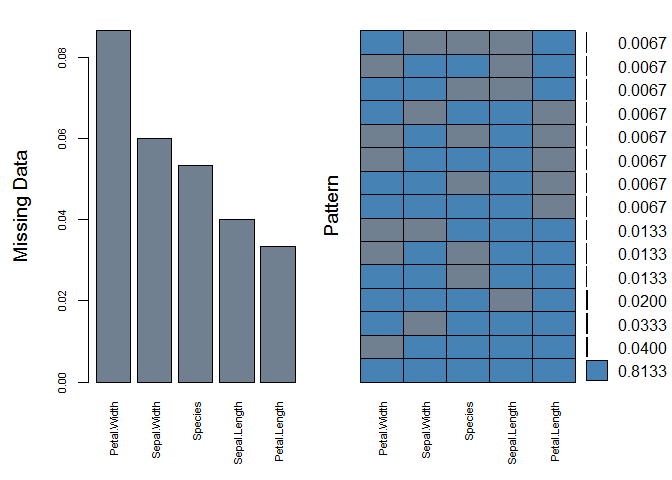
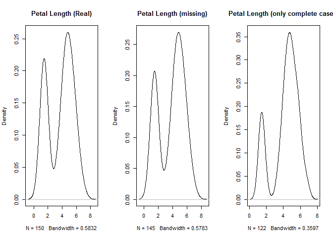
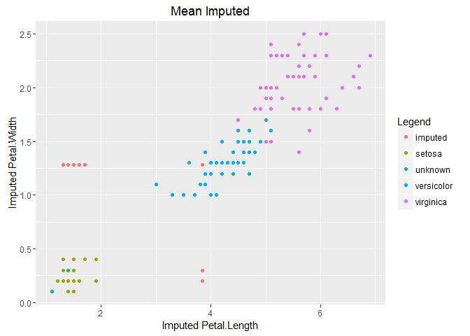
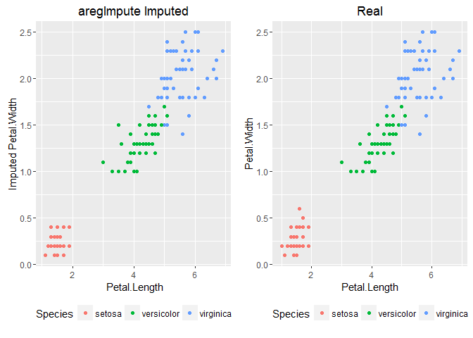
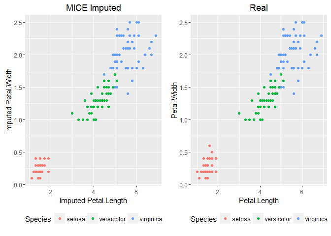
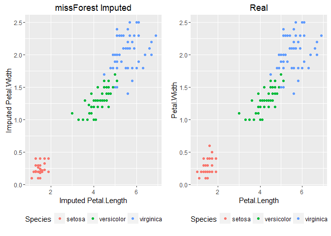

About Me
--------

-   Lifelong learner
-   Masters in Applied Economics from UND
-   Currently a Research Data Analyst at Allina Health

> @github: [datamused](https://github.com/datamused/)
> @LinkedIn: www.linkedin.com/in/patrickdmobley

The data
--------

Iris Data Set

-   Setosa
-   Versicolour
-   Virginica

50 observations each

Why is missing data a problem?
------------------------------

Loss of power

    ##   Sepal.Length Sepal.Width Petal.Length Petal.Width Species
    ## 1          5.1         3.5          1.4         0.2  setosa
    ## 2          4.9         3.0          1.4         0.2  setosa
    ## 3          4.7         3.2          1.3         0.2  setosa
    ## 4          4.6         3.1          1.5         0.2  setosa
    ## 5          5.0         3.6          1.4         0.2  setosa
    ## 6          5.4         3.9          1.7         0.4  setosa

    ##   Sepal.Length Sepal.Width Petal.Length Petal.Width Species
    ## 1          4.3         3.0          1.1         0.1  setosa
    ## 2          4.4         2.9          1.4         0.2  setosa
    ## 3          4.4         3.0           NA          NA  setosa
    ## 4          4.4         3.2          1.3         0.2  setosa
    ## 5          4.5         2.3          1.3         0.3  setosa
    ## 6          4.6         3.4          1.4          NA  setosa

-   6.4% of the data is missing.
-   However, only 118 complete rows (78.7%) are left.

Even small amounts of missing data, can result in large data loss.

Visualizing the problem
-----------------------

    #install.packages("VIM")
    require(VIM)
    aggr(iris.mis, col=c('steelblue','slategrey'),numbers=TRUE,sortVars=TRUE,
        labels=names(iris.mis),cex.axis=.7,gap=3,ylab=c("Missing Data","Pattern"))

    ## 
    ##  Variables sorted by number of missings: 
    ##      Variable      Count
    ##  Petal.Length 0.08666667
    ##   Sepal.Width 0.08000000
    ##   Petal.Width 0.05333333
    ##       Species 0.05333333
    ##  Sepal.Length 0.04666667

------------------------------------------------------------------------

Bias

Goals for Missing Data Models
-----------------------------

1.  Minimize bias.
2.  Maximize the use of available information.
3.  Yield good estimates of uncertainty.

Taken from Paul Allison's chapter on missing data referenced at end of
presentation.

1.  Although it is well-known that missing data can introduce bias into
    parameter estimates, a good method should make that bias as small
    as possible.
2.  We want to avoid discarding any data, and we want to use the
    available data to produce parameter estimates that are efficient
    (i.e., have minimum- sampling variability).
3.  We want accurate estimates of standard errors, confidence intervals
    and p-values.

Three types of missing data
---------------------------

-   MCAR - Missing Completely At Random
-   MAR - Missing At Random
-   MNAR - Missing Not At Random

They each have different implications.

Methods to deal with missing data
---------------------------------

> -   Deletion
>     -   Listwise
>     -   Pairwise

> -   Imputation
>     -   Mean
>     -   Median
>     -   More complex methods

Each method makes different assumptions or is optimized for a particular
type of data (i.e. ordinal, categorical, continuous, discrete, time
series, panel etc.). Choose the method that fits your data type and
problem best. You will likely need to learn a few different methods to
handle various types of data.

Keep in Mind
------------

> All models are wrong, but some are useful

      - famed statistician George Box

Missing Data Packages in R
--------------------------

> -   Imputation
>     -   Hmisc
>     -   [missForest](https://stat.ethz.ch/education/semesters/ss2013/ams/paper/missForest_1.2.pdf)
>     -   [MICE](https://www.jstatsoft.org/index.php/jss/article/view/v045i03/v45i03.pdf)
>     -   [Amelia](https://cran.r-project.org/web/packages/Amelia/vignettes/amelia.pdf)

> -   Tools and visulaization
>     -   mitools
>     -   [VIM](http://www.statistik.tuwien.ac.at/forschung/CS/CS-2008-1complete.pdf)

Example in Hmisc
----------------

    #install.packages("Hmisc")
    require(Hmisc)

`impute()` function replaces the missing value with user defined
statistical method (default=median | mean | max etc.)

    iris.mis$imputed.Petal.Length <- 
                  with(iris.mis, impute(Petal.Length, mean))
    iris.mis$imputed.Petal.Width <- 
                  with(iris.mis, impute(Petal.Width, mean))

------------------------------------------------------------------------

------------------------------------------------------------------------

`aregImpute()` function creates multiple imputations using additive
regression, bootstrapping, and predictive mean matching.

    imputed_aregImpute <- aregImpute(~ Sepal.Length + Sepal.Width 
                            + Petal.Length + Petal.Width + Species,
                            data = iris.mis, n.impute = 5)

5 separate imputations to yield good estimates of uncertainty. The
literature suggests 20 or more imputations.

But for now, we want to pool those imputations to graph the results.

    imputed <- as.data.frame(impute.transcan(imputed_aregImpute, 
                               imputation = 1, data = iris.mis, 
                               list.out = TRUE, pr=FALSE, check=FALSE))

------------------------------------------------------------------------

Example in MICE
---------------

MICE stands for Multiple Imputation using Chained Equations

    #install.packages("mice")
    require(mice)
    imputed_mice <- mice(data = iris.mis[1:5], m = 5,
                      method = "pmm", maxit=50, seed=500)

------------------------------------------------------------------------

Example in missForest
---------------------

    #install.packages("missForest")
    require(missForest)

missForest uses an iterative random forest approach to missing data.

It accomplishes this by estimating the accuracy of these predictions and
adjusts the model.

It can also run as parallel process when installing the package
doParallel

------------------------------------------------------------------------

Imputing with missForest:

    #install.packages("doParallel")
    require(doParallel)
    registerDoParallel()                    #registering the processor
    getDoParWorkers()                       #number of processors running
    #vignette("gettingstartedParallel")     #for more information
    imputed_forest <- missForest(iris.mis[1:5], parallelize = "forest")
    imputed_forest$OOBerror                 #calling Out Of Bag error
    iris.mis.forest <- imputed_forest$ximp

------------------------------------------------------------------------

Resources
---------

This presentation:

<https://github.com/datamused/Missing-Data>

Articles:

<http://www.analyticsvidhya.com/blog/2016/03/tutorial-powerful-packages-imputing-missing-values/>

<http://www.analyticsvidhya.com/blog/2016/01/guide-data-exploration/>

Chapters:

<http://www.stats.ox.ac.uk/~snijders/Graham2009.pdf>

<http://www.statisticalhorizons.com/wp-content/uploads/2012/01/Milsap-Allison.pdf>
